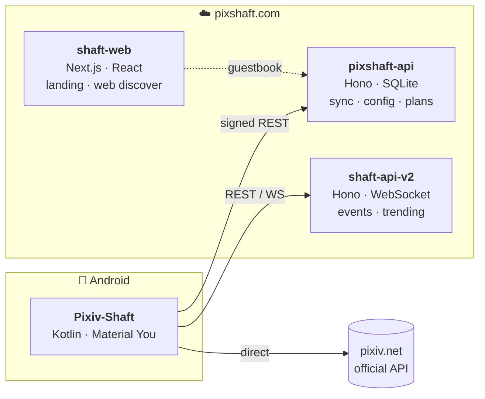

<!-- Panels are generated: python3 scripts/gen_assets.py (same palette / type / glass as pixshaft.com). -->

 

<table>
<tr>
<td width="33.3%"></td>
<td width="33.3%"></td>
<td width="33.3%"></td>
</tr>
</table>

<b>How the three fit together</b> · 三者怎么配合

 

- **Pixiv-Shaft** talks to pixiv directly for content, and to pixshaft.com only for the things pixiv can't give it: cloud-synced settings, remote config, in-app push, plans.
- **pixshaft-api** is a single Node 22 process (Hono + better-sqlite3 in WAL mode, pm2, behind Caddy). Requests are HMAC-signed by the app; every route is rate-limited. **shaft-api-v2** sits beside it for community events and trending, with a WebSocket channel and a React admin console.
- **shaft-web** is the Next.js 16 site at pixshaft.com — the landing page and the `/web` discover page. Both backends and the site are private repos for now; the running product is the public part.

Pixiv-Shaft 直连 pixiv 拿内容，只把 pixiv 给不了的事交给 pixshaft.com：设置云同步、远程配置、应用内推送、订阅。pixshaft-api 是单进程 Node 22（Hono + better-sqlite3 WAL，pm2，Caddy 前置），请求由 app 侧 HMAC 签名、逐路由限流；shaft-api-v2 负责社区事件与热榜，带 WebSocket 与 React 管理台。shaft-web 是 pixshaft.com 的 Next.js 16 官网 + `/web` 网页端发现页。后端与官网目前私有，线上产品本身是公开的那部分。

 

<table>
<tr>
<td width="33.3%"></td>
<td width="33.3%"></td>
<td width="33.3%"></td>
</tr>
</table>

 

  

 

<a href="https://play.google.com/store/apps/details?id=ceui.pixiv.pshaft">Google Play</a> ·
<a href="https://github.com/CeuiLiSA/Pixiv-Shaft/releases/latest">GitHub Releases</a> ·
<a href="https://pixshaft.com">pixshaft.com</a> ·
<a href="https://pixshaft.com/web">Web discover</a> ·
💗 <a href="https://afdian.com/a/pixshaft">afdian.com/a/pixshaft</a>
&nbsp;&nbsp;|&nbsp;&nbsp; 📍 Tokyo · ずっと真夜中でいいのに

