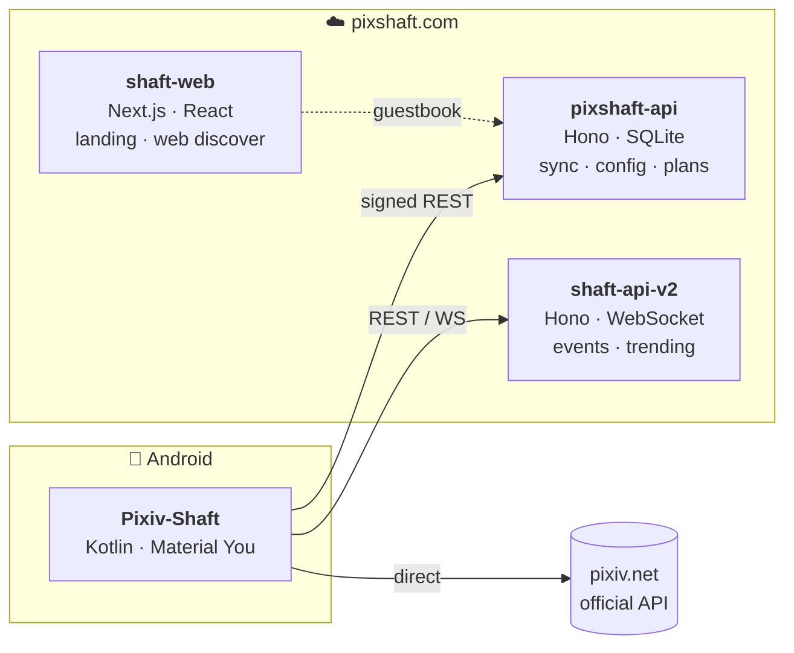

在做 Shaft：一个开源的 Pixiv 第三方安卓客户端，以及它背后的云端服务与官网。

 

## 🧩 The Shaft stack

One app, one backend, one website — designed together so each can stay small. 
一个 app、一套后端、一个官网，三件事一起设计，各自才能保持精简。

<table>
<tr>
<td width="33%" valign="top">

### 📱 Pixiv-Shaft
**The client.** Illustrations, manga, novels, rankings, FANBOX and pixiv COMIC in one Android app — Material You, direct connection in mainland China, no ads. Plus on-device AI: super-resolution, smart cut-out, manga translation (OCR + MT) and RIFE ugoira interpolation.

插画 / 漫画 / 小说 / 排行榜 / FANBOX / pixiv COMIC 全都有；端侧 AI 超分、抠图、漫画翻译、动图补帧。

`Kotlin` `Java` `Coroutines` `Room` `Retrofit` `Glide` `ONNX Runtime` `C++/JNI`

[Source](https://github.com/CeuiLiSA/Pixiv-Shaft) · [Releases](https://github.com/CeuiLiSA/Pixiv-Shaft/releases/latest) · [Google Play](https://play.google.com/store/apps/details?id=ceui.pixiv.pshaft)

</td>
<td width="33%" valign="top">

### ☁️ pixshaft-api
**The backend behind pixshaft.com.** Cloud sync for settings, mute lists and download config; browse history; remote config and in-app push; plans with automatic Afdian fulfilment; curated Prime tag shelves. HMAC-signed requests, per-route rate limiting, single-process SQLite in WAL mode.

设置 / 屏蔽名单 / 下载配置的云同步、浏览历史、远程配置与应用内推送、订阅与爱发电自动发货。

`Node 22` `Hono` `better-sqlite3` `pino` `pm2` `Caddy`

Companion: **shaft-api-v2** — community events + trending API with a React admin console.

🔒 private for now · live at [pixshaft.com](https://pixshaft.com)

</td>
<td width="33%" valign="top">

### 🌐 shaft-web
**The website.** [pixshaft.com](https://pixshaft.com): a motion-heavy landing page (bento features, showcase, pricing, FAQ, guestbook) and a web **discover** page at [/web](https://pixshaft.com/web) with switchable skins and a login flow.

官网落地页（特性 / 界面 / 订阅 / FAQ / 留言板）＋ 网页端「发现」页，可换皮肤，带登录流程。

`Next.js 16` `React 19` `TypeScript` `Tailwind v4` `motion` `GSAP` `Lenis`

🔒 private for now · live at [pixshaft.com](https://pixshaft.com)

</td>
</tr>
</table>

 

## 🧪 Also on the bench

- [**StackSwipe**](https://github.com/SoxiaLiSA/StackSwipe) — iOS-style app switcher for Jetpack Compose with physics-based animations
- [**pixiv-login**](https://github.com/SoxiaLiSA/pixiv-login) — Android library for Pixiv OAuth 2.0 login (PKCE), one dependency via JitPack
- [**Shaft**](https://github.com/SoxiaLiSA/Shaft) — a SwiftUI prototype of Shaft (discover feed, detail, token refresh); a full iOS client is in progress privately

 

## 🛠️ Toolbox

 

💗 Shaft is free and open source. If it saves you a scroll or two: <a href="https://afdian.com/a/pixshaft">afdian.com/a/pixshaft</a>

